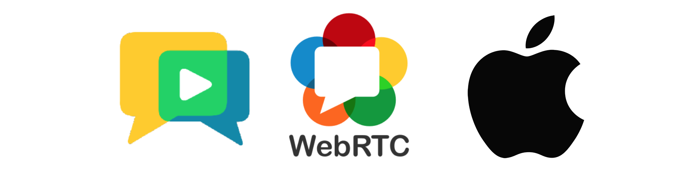
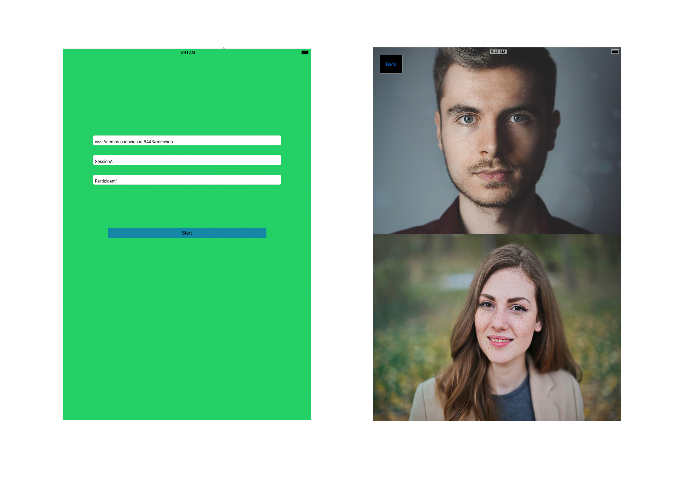
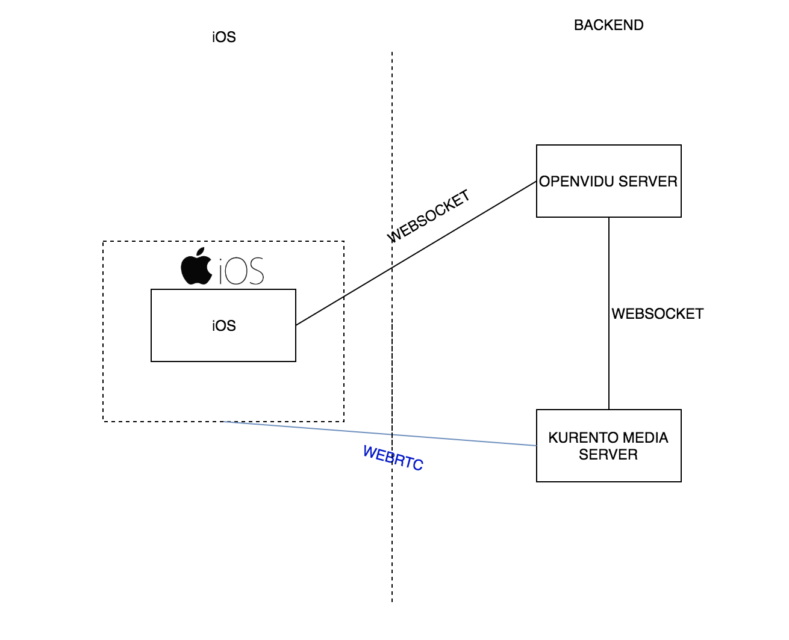

# WebRTCiOS

WebRTCapp is a small elaboration that is part of my final degree project. This app aims to be a small video conference app created using mainly WebRTC technology. 
With it, you can make calls though a web socket connection. 
## OpenVidu
The app was built based on connecting to OpenVidu , an open source project that provides 
several libraries implementations to create video conference apps. For more info on whats the project about
I highly recommend you to go and check the following links

- [OpenVidu's Docs](http://openvidu.io/docs/home/)

- [OpenVidu's Project Web](http://openvidu.io/)

- [OpenVidu's GitHub](https://github.com/OpenVidu)



## Libraries in the project
### WebRTC Library
You can find the code for the WebRTC library right on WebRTC's organization [web](https://webrtc.org/native-code/android/). I wrote a briefly post on how WebRTC works internally that you can find 
[here](https://medium.com/@SergioPaniego/how-webrtc-works-internally-b4cf678c7587). 
On WebRTC's web you will find how to compile the binaries and generate the library but I chose an already built library called [GoogleWebRTC](https://cocoapods.org/pods/GoogleWebRTC)

### WebSocket Starscream Library
This library is a WebSocket client designed for Swift. It implementes the protocol definition allowing us to use a WebSocket without having to implement the whole RFC.
Link: [Starscream Library](https://github.com/daltoniam/Starscream)

## How to download the project and run it
If you want to run the project locally, you can download it using the following command. You will need an actual iOS physical device because the emulator doesn't support the video we need to add.
   ```
   git clone https://github.com/sergiopaniego/WebRTCapp
   ```
   
As I mentioned above, the app is part of a final degree project and for that 
reason the address that comes built in the app points to [https://demos.openvidu.io/basic-videoconference/](https://demos.openvidu.io/basic-videoconference/). This URL hosts an OpenVidu's demo app that you can use to test that 
everything works as expected.

## Development Environment
 How did I developed the app? Tools I used 
### XCode 9
This is the most commonly used iOS development IDE. You can download it directly from the AppStore.
### iPad
As device to test the app I used an iPad with iOS 10.2 installed.
## App Permissions
The first time you open the app, it will ask you to give some permissions to the app. The permissions and the reason why we need the is the following:
-	Camera: This permission is compulsory because it wouldn’t make any sense to make a video conference app without using the camera, would it?
-	Record Audio: We need this permission to allow you to share your beautiful voice with the crowd on the other side of the conversation.

## Understanding the code

The code is divided in some packages to make the code easier to mantain.
 - WebSocketListener: This class implements WebSocketDelegate. As its name suggest, this class responsibility is to listen what comes to the socket we have.
 It handles the messages sent by the server
 - PeersManager: Its purpose is to manage the different peers that make a conversation
 - RemoteParticipant: The participants info goes here
 - Views Controllers: This controllers take care of the views out app uses. The first one takes the info to start the session and the second one is the actual session with its video views.
 
 The WebSocket Address is passed to the VideosViewController using a segue and this information is then uses to start the connection
 
 ```
        override func prepare(for segue: UIStoryboardSegue, sender: Any?)
    {
        if segue.destination is VideosViewController
        {
            let vc = segue.destination as? VideosViewController
            vc?.url = url.text!
            vc?.sessionName = sessionName.text!
            vc?.participantName = participantName.text!
        }
    }
```
            
 
 *url* represents the url the socket will try to connect to.
 *participantName* the name you give to the participant and 
 *sessionName* the session name. This 3 fields are used to complete the address used to connect to the WebScoket.
 
 ```
    socket = WebSocket(url: URL(string: url)!)
    socket.connect()
 ```
 
In this part of the code is where the connecting happens, using the address that is built using the fields above. 

Once the connection is established, you need to join a room, what it's made as follows
```
    var joinRoomParams: [String: String] = [:]
    joinRoomParams["recorder"] = "false"
    joinRoomParams[JSONConstants.Metadata] = "{\"clientData\": \"" + participantName + "\"}"
    joinRoomParams["secret"] = "MY_SECRET"
    joinRoomParams["session"] = sessionName
    joinRoomParams["token"] = token
    sendJson(method: "joinRoom", params: joinRoomParams)
```
Using a JSON using RPC 2.0 with joinRoom method and the params that are shown here you can connect to the room
Same process to leave the room, you just have to send 
```
    self.socket?.sendJson(method: "leaveRoom", params: [:])
```
a JSON RPC 2.0 with the method leaveRoom and empty params.
